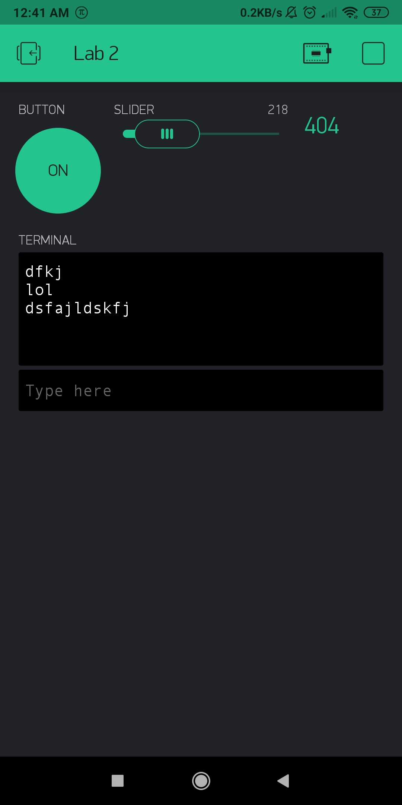

Name: Kerry Tu

EID: kt25566

Team Number: F13

## Questions

1. What is the purpose of an IP address?

    The IP address identifies the machines connected to the interconnection of networks.

2. What is a DNS? What are the benefits of using domain names instead of IP addresses?

    A DNS is a Domain Name Service, and it maps a symbolic name to its corresponding IP address. A benefit is that domain names are easier to remember.

3. What is the difference between a static IP and a dynamic IP?

    A static IP address does not change when assigned, but dynamic IP addresses can change over time and are assigned by the network.

4. What is the tradeoff between UDP and TCP protocols?

    UDP is connectionless and unreliable but fast, while TCP is connection-based and reliable meaning no loss.

5. Why can't we use the delay function with Blynk?

    Blynk is event based, so using the delay function will mess up the timing and break it.

6. What does it mean for a function to be "Blocking"?

    A function that is blocking means that nothing else can run while it is running.

7. Why are interrupts useful for writing Non-Blocking code?

    Interrupts only activate when an action occurs, so less time is wasted while nothing happens.

8. What is the difference between interface and implementation? Why is it important?

   An interface defines how a function is called, while the implementation describes what the function actually does. It is important because other functions can be written to use the implemented function before it is modified and written by the programmer.

9. Screenshot of your Blynk App:

    
